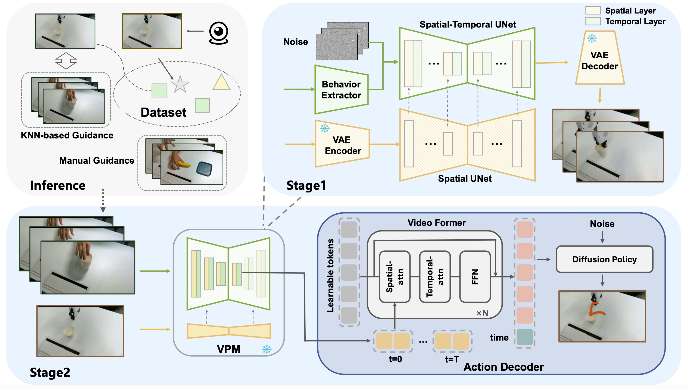

<h1>Human2Robot: Learning Robot Actions from Paired Human-Robot Videos</h1>

    Sicheng Xie*,
    Haidong Cao*,
    Zejia Weng,
    Zhen Xing,
    Haoran Chen,
    Shiwei Shen,
    Jiaqi Leng, 
    <a href="https://zxwu.azurewebsites.net/" target="_blank">Zuxuan Wu</a>&dagger;,
    Yu-Gang Jiang

    * Equal Contribution&emsp;
    &dagger; Corresponding author&emsp;

    <em>Accepted as Oral at AAAI 2026.</em>

    

Code will be released here.